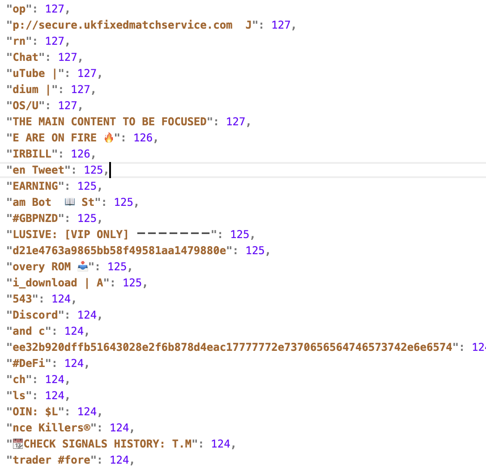
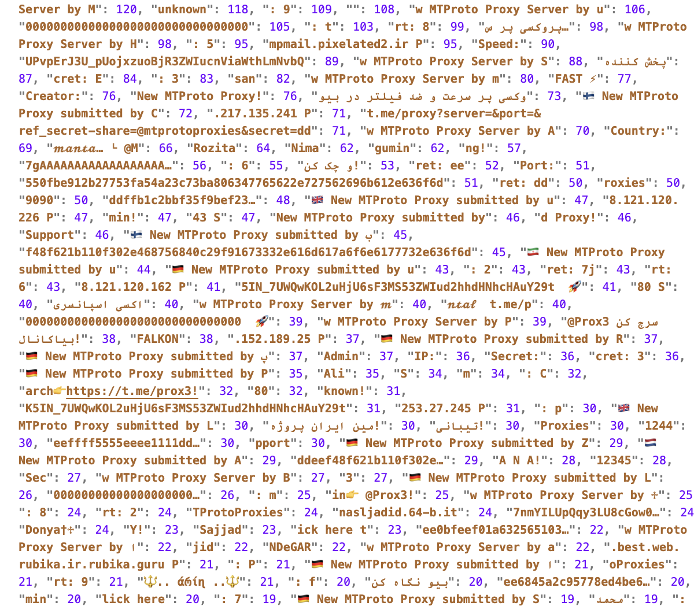

# The Telegram Toolkit: a Tool to Enrich Telegram Channel Data

## Description

The method offers a Telegram data enrichment toolkit that enhances the Telegram messages by uncovering implicit information, otherwise not directly available through the platform. It reveals the channel connections i.e., channel to channel graph, provide message forwarding chain and extracts entities across channels. The method reads raw Telegram messages as JSON and extracts the additional information aggregated into new JSON files. The nature of messages on the platform and their penetration across multiple channels can address interesting research questions.

<!-- **Output** sample from *entity_frequency.json*  -->

## Use Cases

**Usecase 1:** Upon finding the Telegram Toolkit in the Methods Hub, John explores its features and capabilities. He discovers functionalities such as entity identification and message chain generation, which are relevant to his research on disinformation in Telegram channels. John obtains a dataset of messages collected from Telegram channels using appropriate data collection methods. He ensures that the dataset covers the relevant period corresponding to the US Presidential Elections and contains messages from channels known for spreading political information and disinformation. John imports the collected dataset into the Telegram Toolkit for analysis. He verifies the integrity and format of the data to ensure compatibility with the Toolkit's processing algorithms. Using the Toolkit's entity identification feature, John identifies key entities related to the Presidential Elections within the dataset. Then, he creates the message chains; now he can investigate how disinformation propagates through message forwarding chains and explores the dynamics of information diffusion within the network.

**Usecase 2:** Sarah designs her research study to explore the socia l dynamics within Telegram communities, focusing on the role of message-forwarding networks in shaping community boundaries and subgroup formations. Sarah collects a dataset of messages from a diverse range of Telegram channels representing various communities and topics of interest. She ensures that the dataset covers a sufficient period to capture the evolution of community dynamics. Sarah uses the Telegram Toolkit to extract the channel-to-channel graph. She can now identify central nodes, clusters, and subgroups within the networks to understand how information flows and circulates within the communities.

## Input Data


Below is a simple sample of the dataset provided under the *data/* directory (each line is a JSON object):

```jsonl
{"id": 1, "date": "2023-01-01T12:00:00", "channel_id": 100, "message": "Happy New Year! #2023", "entities": [{"type": "hashtag", "offset": 18, "length": 5}]}
{"id": 2, "date": "2023-01-01T12:01:00", "channel_id": 101, "message": "Visit our site: https://example.com", "entities": [{"type": "url", "offset": 17, "length": 19}]}
{"id": 3, "date": "2023-01-01T12:02:00", "channel_id": 102, "message": "Forwarded from channel 100", "forwarded_from": {"channel_id": 100, "message_id": 1}}
```

**Note** - We use JSONL (JSON Lines) rather than JSON , since it allows streaming and processing large datasets line-by-line, making it memory-efficient and easier to handle incrementally.

### Metadata Explanation

1.  **id**: Unique identifier for the message.
2.  **date**: Timestamp indicating when the message was sent.
3.  **channel_id**: Identifier for the Telegram channel where the message was posted.
4.  **message**: The content of the message.
5.  **entities**: A list of entities (e.g., hashtags, URLs) detected in the message, with their type, offset, and length.
6.  **forwarded_from**: (Optional) Metadata for forwarded messages, including the original channel ID and message ID.

This structure allows the Telegram Toolkit to process and enrich the data effectively.

If interested the user can feed the TelegramToolkit with the data collected by [TelegramDataCollector]()

## Output Data


Sample outputs (using the data under *data/*) are provided for clarity:

- **Entities Output** (`sample_output_entities/`):
  - Each message with its extracted entities made explicit.
  - **Example:**
    ```jsonl
    {"id": 1, "entities": [{"type": "hashtag", "text": "#2023"}]}
    {"id": 2, "entities": [{"type": "url", "text": "https://example.com"}]}
    ```

- **Channel-to-Channel Graph** (`sample_output/mygraph.gml`):
  - Shows which channels forward messages to others.
  - **Example (GML format):**
    ```
    graph [
      node [ id 100 label "Channel 100" ]
      node [ id 102 label "Channel 102" ]
      edge [ source 100 target 102 count 1 ]
    ]
    ```

- **Message Chain CSV** (`sample_output/my_message_chain.csv`):
  - Shows how messages are forwarded between channels.
  - **Example:**
    ```csv
    source_message_id,source_channel_id,dest_message_id,dest_channel_id,time,message_text
    1,100,3,102,2023-01-01T12:02:00,Forwarded from channel 100
    ```

- **Entity Frequency (Whole Data)** (`sample_output/entity_frequency.json`):
  - Counts of each entity type across all messages.
  - **Example:**
    ```json
    {
      "#2023": 1,
      "https://example.com": 1
    }
    ```

- **Entity Frequency by Channel** (`sample_output/entity_frequency_channels.jsonl`):
  - Counts of each entity type per channel.
  - **Example:**
    ```jsonl
    {"channel_id": 100, "entities": {"#2023": 1}}
    {"channel_id": 101, "entities": {"https://example.com": 1}}
    ```

## Hardware Requirements

The current file runs in ~5 mins on Apple silicon chip. But Depending on the scale of data (in Millions), the method requires GPU with (2 x Intel Xeon 2.1 GHz (2 x 24 Cores, 2 x 48 Threads) and 1.4 TB RAM).

## Environment Setup

Install the requirements by running `pip install -r requirements.txt`

## How to Use

This is simple to use! You can run it without any arguments for default behavior. If you need help or want to explore optional parameters, just use the `-h` flag to display the help menu.

```         
--Bash/CMD command--
TelegramToolkit.py [-h] [-i INPUT_DATA_DIR] [-o OUTPUT_DATA_DIR] [-re] [-ccg] [-cmc] [-gn GRAPH_NAME] [-mcn MESSAGE_CHAIN_NAME] 
                   [-ef] [-efth ENTITY_FREQUENCY_THRESHOLD] [-eft] [-efs ENTITY_FREQUENCY_DEST] [-efc] [-efcth ENTITY_FREQUENCY_CHANNEL_THRESHOLD]
                  [-efct] [-efcs ENTITY_FREQUENCY_CHANNEL_DEST]
```

To learn more about the description of the parameters use `TelegramToolkit.py -h`

Which outputs:

```         
options:
  -h, --help            show this help message and exit
  -i INPUT_DATA_DIR, --input-data-dir INPUT_DATA_DIR
                        The input directory containing raw data from Telegram. Default: 'data/'
  -o OUTPUT_DATA_DIR, --output-data-dir OUTPUT_DATA_DIR
                        The output directory where the results will be saved. Default: 'out/'
  -re, --resolve-entities
                        Resolve the entities in the raw Telegram data collection.
  -ccg, --create-channel-graph
                        Create the channel-to-channel graph from the Telegram data collection.
  -cmc, --create-message-chain
                        Create the message chains of the messages from the Telegram data collection.
  -gn GRAPH_NAME, --graph-name GRAPH_NAME
                        Name of the graph created using the '-ccg' or '--create-channel-graph' option. Default: mygraph
  -mcn MESSAGE_CHAIN_NAME, --message-chain-name MESSAGE_CHAIN_NAME
                        Name of the CSV file containing the information to which channels a message was forwarded to. 
                        It only works with either '-cmc' or '--create-message-chain' option.
                        Default: my_message_chain
  -ef, --entity-frequency
                        Compute the frequency of the entities on the whole data.
  -efth ENTITY_FREQUENCY_THRESHOLD, --entity-frequency-threshold ENTITY_FREQUENCY_THRESHOLD
                        Threshold to cut the entity frequency. Only entities appearing a number of times equal to or greater than the threshold are saved. 
                        It only works with either '-ef' or '--entity-frequency' option. Default: 1
  -eft, --entity-frequency-type
                        The Telegram Toolkit will consider the entity type while computing the entity frequency. 
                        It only works with either '-ef' or '--entity-frequency' option.
  -efs ENTITY_FREQUENCY_DEST, --entity-frequency-save ENTITY_FREQUENCY_DEST
                        The output file name containing the entity frequency. 
                        It only works with either '-ef' or '--entity-frequency' option. 
                        Default: entity_frequency
  -efc, --entity-frequency-channel
                        Compute the frequency of the entities over channels.
  -efcth ENTITY_FREQUENCY_CHANNEL_THRESHOLD, --entity-frequency-channel-threshold ENTITY_FREQUENCY_CHANNEL_THRESHOLD
                        Threshold to cut the entity frequency over channels. Only entities appearing a number of times equal to or greater than the threshold are saved. 
                        It only works with either '-efc' or '--entity-frequency-channel' option. 
                        Default: 1
  -efct, --entity-frequency-channel-type
                        The Telegram Toolkit will consider the entity type while computing the entity frequency over channels. 
                        It only works with either '-efc' or '--entity-frequency-channel' option.
  -efcs ENTITY_FREQUENCY_CHANNEL_DEST, --entity-frequency-channel-save ENTITY_FREQUENCY_CHANNEL_DEST
                        The output file name containing the entity frequency over channels. 
                        It only works with either '-efc' or '--entity-frequency-channel' option. 
                        Default: entity_frequency_over_channels
```

## Usage examples
- Resolve entities only:
  `python TelegramToolkit.py -i data/ -o out/ -re`
- Build channel graph and save as `mygraph.gml`:
  `python TelegramToolkit.py -i data/ -o out/ -ccg -gn mygraph`
- Compute entity frequencies (type-aware):
  `python TelegramToolkit.py -i data/ -o out/ -ef -eft -efs entity_frequency`


## Technical Details

The Telegram Toolkit provides the following functionalities:

1.  *Entities in Telegram*. Entities are provided only using text span indexes; the Telegram Toolkit extracts them.

2.  *Creates Channel to channel graph*. Given the collected data, it creates a channel-to-channel graph where nodes are the channels and edges are built when a message is forwarded from a channel (source) to a destination channel. This functionality creates a graph in [GML format](https://networkx.org/documentation/stable/reference/readwrite/gml.html). The edges are associated with the times when messages are forwarded.

3.  *Message chain generation*. When you post a message and someone re-posts or forwards it, you can usually see where and when the message is forwarded. This does not happen with Telegram messages. As a solution, this functionality creates a CSV file where each source message (i.e., a new message) is associated at least with one destination message (i.e., forwarded message), the forwarding time, and the message text. Messages that are never forwarded do not appear in the CSV. The user must note that the source message and its channel might not be contained in the input collection of data; this is because Telegram does not provide information about where a message is forwarded and the proposed generation uses a backward mechanism starting from the destination messages.

4.  *Compute the frequency of the entities over channels.* The tool computes the frequency of the entities for each channels.

5.  *Compute the frequency of the entities over whole data collection.* The tool computes the frequency of the entities on the whole data.

**Relevant research questions that could be addressed with the help of this method**

The Telegram Toolkit is designed to provide enriched data and features to address research questions like:

1.  *Information Flow Analysis*: How does the use of the Telegram channel graph and entities enhance our understanding of information dissemination patterns within and across Telegram channels?

2.  *Network Analysis*: What insights can be gained from analyzing the network structure of Telegram channels and their connections using the features provided by the Telegram Toolkit?

3.  *Content Analysis*: How does the content shared across Telegram channels evolve over time, and how can entities assist in identifying trends, biases, and influential content creators?

4.  *Audience Engagement Analysis*: To what extent does audience engagement, measured by factors such as message forwarding chains and user interaction, contribute to the success and longevity of Telegram channels?

5.  *Community Structure and Boundary Formation*: How do the structures of message forwarding networks, uncovered by the TelegramToolkit, inform our understanding of community boundaries, subgroup formations, and the processes of inclusion and exclusion within Telegram ecosystems, and what implications do these dynamics have for social cohesion and identity formation?

6.  *Disinformation and Misinformation Tracking*: How can the tracking of message propagation pathways assist in unraveling the dynamics of misinformation dissemination, rumor amplification, and collective sensemaking processes within Telegram channels, and what strategies can be devised to foster critical thinking and information literacy in online communities?

<!--  **sample output** from *channel_entity_freq.json* -->

## Disclaimer

The Telegram Toolkit is designed to work with .jsonl files where each line of a file represents a [Telegram message as described by the Telethon API](https://tl.telethon.dev/constructors/message.html).

## Contact Details

For further queries, please contact <Susmita.Gangopadhyay@gesis.org>
